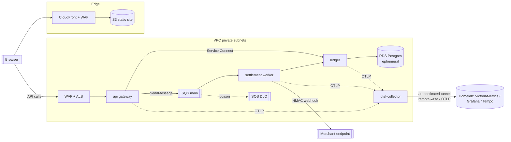
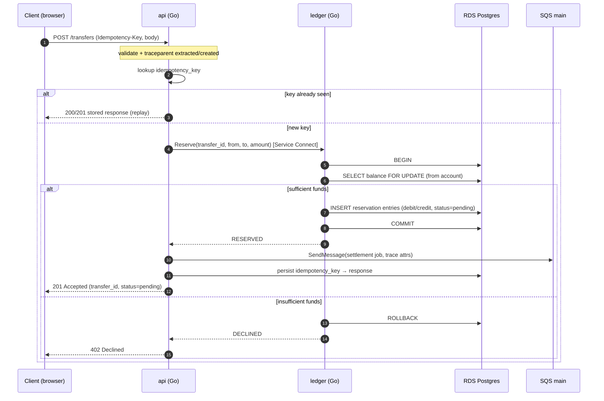

# Architecture — bank-of-the-people

A stripped-down core of a fintech money-movement platform: money transfers backed by a
double-entry ledger, with **synchronous authorization** and **asynchronous settlement**
plus **signed webhook delivery**. The application is deliberately thin; the engineering
depth lives in the infrastructure, CI/CD pipeline, security posture, and observability.

- Compute: AWS ECS on **Fargate** (see [ADR-0002](adr/0002-compute-fargate-vs-ec2.md)).
- Region / accounts: single account, single live environment, `us-east-1`
  (see [ADR-0007](adr/0007-single-account-single-env-topology.md)).
- Ledger store: ephemeral in-VPC **RDS PostgreSQL**
  (see [ADR-0005](adr/0005-ledger-datastore.md)).
- Messaging: **SQS standard** + DLQ (see [ADR-0001](adr/0001-messaging-sqs-vs-kafka.md)).
- Observability: homelab **VictoriaMetrics + Grafana + Tempo** via authenticated
  remote-write from ECS (see [ADR-0004](adr/0004-observability-stack.md)).

---

## 1. Monorepo layout

```
bank-of-the-people/
├── frontend/                 # React/Next (TS), static export → S3 + CloudFront
├── services/
│   ├── api/                  # Go — public payments gateway (behind ALB)
│   ├── ledger/               # Go — double-entry ledger (internal only)
│   └── worker/               # Go — settlement worker (SQS consumer + webhooks)
├── infra/
│   ├── modules/              # reusable Terraform modules (network, ecs-service, …)
│   └── live/<env>/           # per-env root configs (dev, prod) — one live at a time
├── policy/                   # OPA/Conftest policies (IaC + image gates)
├── docs/                     # this documentation set
│   ├── adr/                  # architecture decision records
│   └── runbooks/             # operational runbooks (seeded in PLAN P10)
└── .github/workflows/        # CI/CD (OIDC to AWS, no static keys)
```

Rationale: a monorepo keeps the app, infra, and policy versioned together so a single PR
can move code + infra + guardrails atomically, and CI can reason about the whole change.

---

## 2. Service topology

Single VPC across (at least) two AZs.

- **Public subnets:** ALB, NAT Gateway. Nothing else is internet-facing.
- **Private subnets:** all ECS tasks and RDS. No public IPs on tasks.
- **VPC endpoints** (Interface: ECR api/dkr, Secrets Manager, CloudWatch Logs, SQS;
  Gateway: S3) so image pulls, secret fetches, logs, and queue traffic stay on the AWS
  network and **do not traverse (or bill through) the NAT Gateway**.

| Service | Ingress | Egress | Notes |
|---------|---------|--------|-------|
| `api` (Go) | ALB target group (HTTPS) | ledger (Service Connect), SQS | Public payments gateway. WAF web ACL attached to the ALB. |
| `ledger` (Go) | **internal only** via ECS Service Connect / Cloud Map | RDS Postgres | No ALB, no public route. Sole writer to the ledger schema. |
| `worker` (Go) | **none** (polls SQS) | ledger/RDS, merchant webhook endpoints | Consumes settlement queue; dispatches signed webhooks; autoscales on backlog. |
| `otel-collector` | OTLP from services (Service Connect) | homelab (tunnel) | Receives traces/metrics, remote-writes to VictoriaMetrics, exports spans to Tempo. |

Frontend is a **static** Next export served from **S3 behind CloudFront** (edge WAF);
it calls the `api` origin behind the ALB. No frontend ECS task
(see [ADR-0007](adr/0007-single-account-single-env-topology.md) for the topology
context; hosting choice recorded in PLAN P5).



> 📐 Editable AWS-shape source: [`assets/topology.drawio`](assets/topology.drawio)
> (open in [diagrams.net](https://app.diagrams.net) or the VS Code Draw.io extension).

---

## 3. Synchronous data flow — authorization

The caller gets a definitive **authorized / declined** answer before the HTTP response
returns. Funds are reserved in the ledger on this path; nothing is settled yet.



> 📐 Editable source: [`assets/sync-authorization.drawio`](assets/sync-authorization.drawio).

Key points:
- **Ledger is the synchronous dependency**; it is in-region RDS, so authorization
  latency is engineerable and not polluted by the homelab tunnel
  (this is exactly why [ADR-0005](adr/0005-ledger-datastore.md) rejects homelab CNPG).
- The **reservation** is an append-only, balanced pair of pending entries. Balance is
  `SUM(entries)`; the `FOR UPDATE` row lock prevents concurrent double-spend
  (see [ADR-0003](adr/0003-ledger-consistency-model.md)).
- Enqueue happens **after** a successful reserve, so a settlement job only ever exists
  for authorized funds.

---

## 4. Asynchronous data flow — settlement + webhook

```mermaid
sequenceDiagram
    autonumber
    participant Q as SQS main
    participant W as worker (Go)
    participant L as ledger (Go)
    participant DB as RDS Postgres
    participant M as Merchant endpoint
    participant D as SQS DLQ

    W->>Q: ReceiveMessage (long poll)
    Note over W: restore traceparent from message attributes
    W->>L: Finalize(transfer_id)
    L->>DB: BEGIN
    L->>DB: INSERT settlement entry (UNIQUE transfer_id)
    alt first finalize
        L->>DB: mark transfer settled; COMMIT
        L-->>W: SETTLED
    else duplicate delivery (at-least-once)
        L->>DB: unique violation → ROLLBACK
        L-->>W: ALREADY_SETTLED (idempotent no-op)
    end
    W->>M: POST webhook (HMAC-SHA256 signature)
    alt 2xx
        M-->>W: 200
        W->>Q: DeleteMessage
    else non-2xx / timeout
        M-->>W: 5xx
        Note over W: leave message → SQS redelivers after visibility timeout (backoff)
        W-->>Q: (no delete)
        Note over Q: after maxReceiveCount → DLQ
        Q->>D: move poison message
    end
```

> 📐 Editable source: [`assets/async-settlement.drawio`](assets/async-settlement.drawio).

Key points:
- **At-least-once** delivery means the worker must be idempotent. Finalize is idempotent
  because the settlement entry carries a `UNIQUE(transfer_id)` constraint — a redelivered
  message that tries to settle again hits the constraint and becomes a no-op. **No
  double-spend under retries.**
- **Retry/backoff** is delegated to SQS visibility timeout + redrive; the worker does not
  hand-roll a retry loop for the *message*, only for the *webhook HTTP call* (bounded
  in-process retries with jittered backoff before giving the message back to the queue).
- **DLQ** captures poison messages after `maxReceiveCount`, with a documented redrive
  procedure (runbook, PLAN P10).

---

## 5. Messaging contract

**Queue:** SQS **standard** (at-least-once, best-effort ordering) with a redrive policy
to a dedicated DLQ. Standard over FIFO is deliberate: FIFO's exactly-once *processing* is
scoped and throughput-limited, and leaning on it would hide the idempotency work the
brief explicitly asks for. Standard + app-level dedup is cheaper and the stronger skills
demonstration (see [ADR-0001](adr/0001-messaging-sqs-vs-kafka.md)).

**Message body (JSON):**

```json
{
  "schema_version": 1,
  "transfer_id": "uuid",          // stable business key; dedup + idempotent finalize
  "idempotency_key": "string",    // original client key (audit/correlation)
  "from_account": "uuid",
  "to_account": "uuid",
  "amount_minor": 100000,          // integer minor units — never floats for money
  "currency": "USD",
  "created_at": "RFC3339",
  "enqueued_at": "RFC3339"         // enqueue timestamp → settlement-lag SLI baseline
}
```

**Message attributes** (transport metadata, kept out of the body):
- `traceparent`, `tracestate` — W3C trace context for unbroken end-to-end tracing.
- `attempt` — surfaced from `ApproximateReceiveCount` for observability.

**Contract invariants:**
- `transfer_id` is the idempotency unit for settlement; consumers MUST treat processing as
  idempotent keyed on it.
- `amount_minor` is an integer in minor units; money is never represented as a float.
- `schema_version` is present so the consumer can evolve the contract without breaking
  in-flight messages.

---

## 6. Idempotency design (sync path)

- `POST /transfers` requires an `Idempotency-Key` header.
- `api` persists `(idempotency_key, request_fingerprint, response, status)` in Postgres
  with a `UNIQUE` constraint on `idempotency_key`.
- On replay:
  - same key **and** same request fingerprint → return the stored response verbatim
    (no second reservation).
  - same key **but different** fingerprint → `409 Conflict` (key reuse with a different
    body is a client error, not a silent overwrite).
- This makes client retries, ALB retries, and browser double-submits safe: a transfer is
  reserved **at most once** per key.

The idempotency record and the reservation are written so that a crash between "reserve"
and "persist idempotency response" cannot produce a charge without a recoverable record;
the reservation itself is keyed by `transfer_id`, so replay reconciles to the same
transfer rather than creating a new one.

---

## 7. DLQ and dedup design (async path)

- **Redrive policy:** `maxReceiveCount = N` (default 5); on exceed, SQS moves the message
  to the DLQ.
- **DLQ handling:** the DLQ is monitored (oldest-message age / visible count). A runbook
  covers inspection, root-cause, fix, and **redrive** back to the main queue.
- **Dedup / no double-spend:** enforced at the ledger, not the queue — `UNIQUE(transfer_id)`
  on the settlement entry means at-least-once redelivery cannot post a second settlement.
  Webhooks may be delivered more than once by design (at-least-once); merchants verify the
  HMAC signature and dedup on `transfer_id`.

---

## 8. Trace propagation (one unbroken trace, end to end)

- Go services use the **OpenTelemetry SDK**; the in-ECS **OTel Collector** exports spans
  to homelab **Tempo** over the authenticated tunnel.
- **Sync side:** W3C `traceparent` / `tracestate` propagate over HTTP — browser → ALB →
  `api` → (Service Connect) `ledger`. Each hop continues the same trace.
- **Async side:** the trace context is copied into **SQS message attributes** at
  `SendMessage`; the `worker` restores it on `ReceiveMessage`, so the settlement span and
  webhook span join the *same* trace as the original authorization.
- Result: a single transfer produces one connected trace spanning the synchronous
  authorization, the queue hop, settlement, and webhook delivery — the core observability
  proof point (captured in PLAN P6).

**Metrics** take a parallel path: services expose Prometheus/OTLP metrics; the Collector
(or vmagent) **remote-writes** to homelab VictoriaMetrics with **on-disk buffering**, so a
homelab/tunnel outage yields a backfillable gap rather than lost samples
(see [ADR-0004](adr/0004-observability-stack.md)). SLIs on the authorization path are
measured **at the `api` inside AWS**, before any homelab dependency — see
[SLO.md](SLO.md).

---

## 9. Consistency, reliability, and failure summary

| Concern | Mechanism |
|---------|-----------|
| Double-spend under client retry | `Idempotency-Key` + unique constraint (sync) |
| Double-spend under queue redelivery | `UNIQUE(transfer_id)` settlement entry (async) |
| Sufficient-funds race | `SELECT … FOR UPDATE` row lock in ledger tx (ADR-0003) |
| Poison messages | DLQ after `maxReceiveCount` + redrive runbook |
| Webhook endpoint down | bounded in-process retry/backoff, then SQS redelivery, then DLQ |
| Homelab/tunnel outage | vmagent on-disk buffer + backfill; metric gaps = "unknown" |
| Bad deploy | CodeDeploy canary + CloudWatch deploy-gate alarms → auto rollback (ADR-0006) |
| Settlement backlog spike | worker autoscaling on SQS backlog-per-task, not CPU (PLAN P9) |
